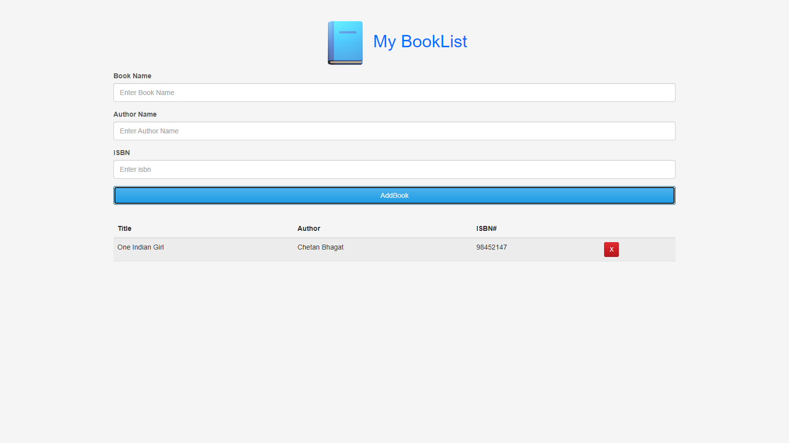
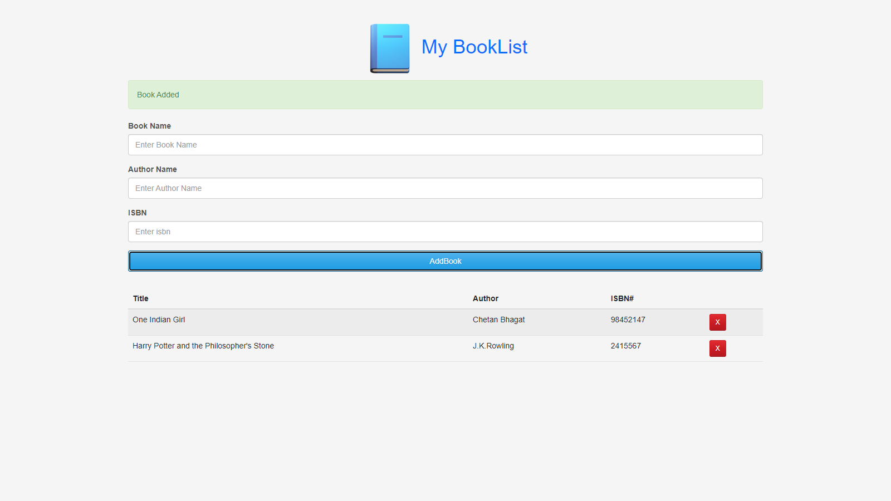
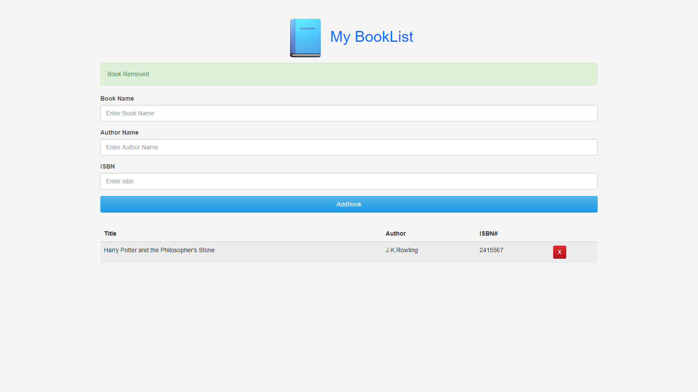

# BookLister

<h3>Description</h3>

BookLister is a simple web application built using HTML, CSS, and JavaScript. It allows users to manage a list of books by adding new books with details such as book name, author name, and ISBN. Users can also remove books from the list. This site helps the user to track their book to be read.

<h3>Features</h3>
<li><b>Add Book : </b> Users can add a new book with details including book name, author name, and ISBN.</li>
<li><b>Remove Book : </b> Users can remove books from the list.</li>
<li><b>LocalStorage : </b> Books are stored locally in the browser's localStorage, so they persist across sessions.</li>
 

<h3>Technologies Used</h3>
<li>HTML</li>
<li>CSS</li>
<li>Java Script</li>

<h3>Usage</h3>

Enter the book details (name, author, ISBN) in the input fields and click the "Add Book" button to add a new book to the list.  
Click the "cross" icon next to a book to remove it from the list.

